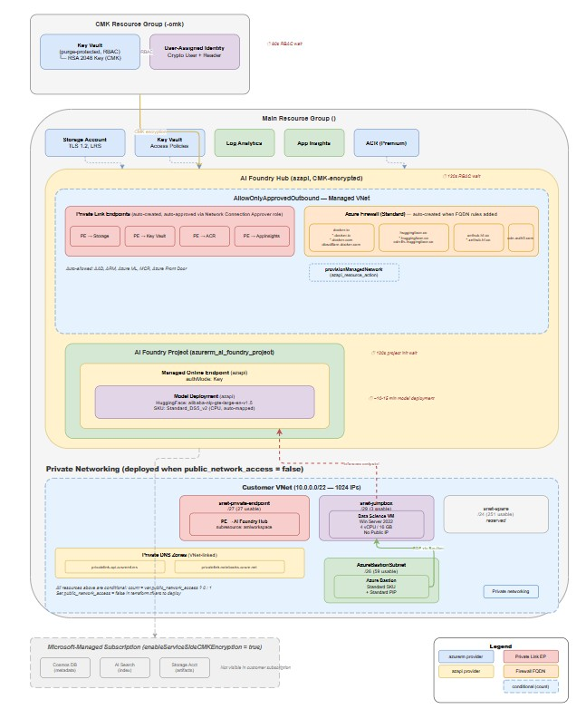
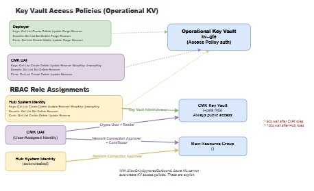

# Azure AI Foundry + Custom Open Source Model from AI Foundry Model Catalog — Terraform Deployment

This Terraform configuration deploys a self-hosted **HuggingFace GTE embedding model** (`alibaba-nlp-gte-large-en-v1.5`) via Azure AI Foundry with CMK encryption and AllowOnlyApprovedOutbound managed network isolation.

## Architecture





> Full editable diagram: [architecture.drawio](architecture.drawio)

<details>
<summary>ASCII Architecture (click to expand)</summary>

```
┌──────────────────────────────────────────────────────────────┐
│  CMK Resource Group (<project>-cmk)                          │
│  ┌────────────────────────────────────────────────────────┐  │
│  │ Key Vault (purge-protected, RBAC)                      │  │
│  │  └─ RSA 2048 Key (CMK for AI Hub encryption)           │  │
│  │ User-Assigned Identity (Crypto User + Reader on KV)    │  │
│  └────────────────────────────────────────────────────────┘  │
└──────────────────────────────────────────────────────────────┘

┌──────────────────────────────────────────────────────────────┐
│  Main Resource Group (<project>)                             │
│                                                              │
│  ┌─────────────┐  ┌──────────┐  ┌─────────────────────────┐ │
│  │ Storage Acct │  │ Key Vault│  │ Log Analytics + AppIns  │ │
│  └──────┬──────┘  └────┬─────┘  └────────────┬────────────┘ │
│         │              │                      │              │
│  ┌──────┴──────────────┴──────────────────────┴───────────┐  │
│  │  AI Foundry Hub (azapi, CMK-encrypted)                 │  │
│  │                                                        │  │
│  │  ┌ AllowOnlyApprovedOutbound Managed VNet ───────────┐ │  │
│  │  │                                                    │ │  │
│  │  │  Private Link Endpoints (auto-created, require     │ │  │
│  │  │  auto-approval via Network Connection Approver):   │ │  │
│  │  │   ├─ PE → Storage Account                         │ │  │
│  │  │   ├─ PE → Key Vault                               │ │  │
│  │  │   ├─ PE → Container Registry (Premium required)   │ │  │
│  │  │   └─ PE → Application Insights                    │ │  │
│  │  │                                                    │ │  │
│  │  │  Azure Firewall (Standard, auto-created):          │ │  │
│  │  │   FQDN Outbound Rules:                            │ │  │
│  │  │   ├─ docker.io  *.docker.io  *.docker.com         │ │  │
│  │  │   ├─ production.cloudflare.docker.com              │ │  │
│  │  │   ├─ cdn.auth0.com                                │ │  │
│  │  │   ├─ huggingface.co  *.huggingface.co             │ │  │
│  │  │   ├─ cdn-lfs.huggingface.co                       │ │  │
│  │  │   └─ xethub.hf.co  *.xethub.hf.co                │ │  │
│  │  │                                                    │ │  │
│  │  │  Auto-allowed (built-in rules):                    │ │  │
│  │  │   AAD, ARM, Azure ML, MCR, Azure Front Door       │ │  │
│  │  └────────────────────────────────────────────────────┘ │  │
│  │                                                        │  │
│  │  ┌───────────────────────────────────────────────────┐ │  │
│  │  │  AI Foundry Project (azurerm_ai_foundry_project)  │ │  │
│  │  │  ┌─────────────────────────────────────────────┐  │ │  │
│  │  │  │  Managed Online Endpoint (azapi)             │  │ │  │
│  │  │  │  └─ Model Deployment (azapi, HuggingFace)    │  │ │  │
│  │  │  └─────────────────────────────────────────────┘  │ │  │
│  │  └───────────────────────────────────────────────────┘ │  │
│  └────────────────────────────────────────────────────────┘  │
│                                                              │
│  ┌──────────────┐                                            │
│  │  ACR (Premium)│                                           │
│  └──────────────┘                                            │
│                                                              │
│  ┌─── Customer VNet (conditional: private mode only) ──────┐ │
│  │                                                          │ │
│  │  ┌─ AzureBastionSubnet /26 ─┐ ┌─ snet-PE /27 ────────┐ │ │
│  │  │  Azure Bastion (Standard) │ │  PE → AI Hub          │ │ │
│  │  └───────────────────────────┘ │  (amlworkspace)       │ │ │
│  │                                └───────────────────────┘ │ │
│  │  ┌─ snet-jumpbox /29 ───────┐ ┌─ snet-spare /24 ──────┐ │ │
│  │  │  Data Science VM (Win22)  │ │  (reserved)           │ │ │
│  │  │  No Public IP             │ └───────────────────────┘ │ │
│  │  └───────────────────────────┘                           │ │
│  │                                                          │ │
│  │  DNS: privatelink.api.azureml.ms                         │ │
│  │       privatelink.notebooks.azure.net                    │ │
│  └──────────────────────────────────────────────────────────┘ │
└──────────────────────────────────────────────────────────────┘

Microsoft-Managed Subscription (enableServiceSideCMKEncryption = true):
  Cosmos DB, AI Search, Storage Account for workspace metadata
  are created and managed entirely by Microsoft in their own
  subscription — not visible in customer's resource groups.
```

</details>

## Prerequisites

- Terraform >= 1.6
- Azure CLI authenticated (`az login`)
- Sufficient Azure quota for `Standard_DS5_v2` in target region

## Provider Strategy

| Resource | Provider | Reason |
|---|---|---|
| Resource Group, Storage, Key Vault, ACR, Log Analytics, App Insights | `azurerm ~> 4.0` | Fully supported, stable |
| CMK Key Vault, Key, User-Assigned Identity, RBAC | `azurerm` | CMK encryption for AI Hub |
| AI Foundry Hub | `azapi ~> 2.0` | CMK + managed network + `kind=Hub` via ARM API |
| AI Foundry Project | `azurerm` | Supported via `azurerm_ai_foundry_project` |
| FQDN Outbound Rules | `azurerm ~> 4.0` | Managed network egress rules via `azurerm_machine_learning_workspace_network_outbound_rule_fqdn` — rules created AFTER managed network provisioning; azurerm read-back may be empty but rules self-heal on next apply |
| Managed Network Provisioning | `azapi` | `provisionManagedNetwork` action (LRO) |
| Online Endpoint + Deployment | `azapi ~> 2.0` | HuggingFace registry model + traffic routing (no azurerm support) |
| Endpoint Traffic Allocation | `azapi ~> 2.0` | `azapi_update_resource` to set 100% traffic after deployment; `terraform_data` destroy provisioner to zero traffic before deletion |
| VNet, Subnets, Bastion, PE, DNS Zones | `azurerm` | Conditional private networking stack (count-gated on `public_network_access`) |
| Data Science VM (Jumpbox) | `azurerm` | Windows Server 2022 DSVM — no marketplace plan required |
| Sleep timer | `time ~> 0.11` | Wait for project services to initialize |

## Naming Convention

All resource names are derived from a single `project_name` variable via `locals.tf`:

| Resource | Pattern | Example (`project_name = "akgte15"`) |
|---|---|---|
| Resource Group | `<project_name>` | `akgte15` |
| Storage Account | `<project_name>gte` | `akgte15gte` |
| Key Vault | `kv-<safe_prefix>-gte` | `kv-akgte15-gte` |
| Container Registry | `acr<safe_prefix>gte` | `acrakgte15gte` |
| AI Hub | `hub-<safe_prefix>` | `hub-akgte15` |
| AI Project | `prj-<safe_prefix>-gte` | `prj-akgte15-gte` |
| Endpoint | `ep-<safe_prefix>-gte` | `ep-akgte15-gte` |
| CMK Resource Group | `<project_name>-cmk` | `akgte15-cmk` |
| CMK Key Vault | `kv-<safe_prefix>-cmk` | `kv-akgte15-cmk` |
| CMK Key | `cmk-<safe_prefix>` | `cmk-akgte15` |
| CMK Identity | `id-<safe_prefix>-cmk` | `id-akgte15-cmk` |
| VNet | `vnet-<safe_prefix>` | `vnet-akgte15` |
| Bastion Host | `bas-<safe_prefix>` | `bas-akgte15` |
| Bastion PIP | `pip-bas-<safe_prefix>` | `pip-bas-akgte15` |
| Jumpbox VM | `vm-<safe_prefix>-dsvm` | `vm-akgte15-dsvm` |
| Private Endpoint (Hub) | `pe-<safe_prefix>-hub` | `pe-akgte15-hub` |

> **Note:** If `project_name` starts with a digit (e.g. `1503ak`), a `p` prefix is auto-added (`safe_prefix = "p1503ak"`) to satisfy Azure naming rules that require names to start with a letter.

## Files

| File | Purpose |
|---|---|
| `versions.tf` | Terraform and provider version constraints |
| `providers.tf` | Provider configuration (KV recovery, RG force delete) |
| `variables.tf` | All input variables with validation |
| `terraform.tfvars` | Minimal config — only `project_name` + deployment params |
| `locals.tf` | All derived resource names + safe prefix logic |
| `main.tf` | Resource group + data sources |
| `storage.tf` | Storage account with ML CORS rules |
| `keyvault.tf` | Key Vault with deployer access policy |
| `monitoring.tf` | Log Analytics + Application Insights + Diagnostic Settings |
| `acr.tf` | Azure Container Registry |
| `cmk.tf` | CMK Key Vault + RSA Key + User-Assigned Identity + RBAC (separate RG) |
| `ai_hub.tf` | AI Foundry Hub (azapi, CMK-encrypted, managed network + FQDN rules) |
| `ai_project.tf` | AI Foundry Project (azurerm_ai_foundry_project) |
| `endpoint.tf` | Online endpoint + model deployment from AI Foundry Model Catalog (azapi) |
| `networking.tf` | Virtual Network + Subnets (conditional on private mode) |
| `bastion.tf` | Azure Bastion Standard SKU (conditional on private mode) |
| `private_endpoint.tf` | Private Endpoint + Private DNS Zones for AI Hub (conditional on private mode) |
| `jumpbox.tf` | Data Science VM jumpbox — Windows Server 2022 (conditional on private mode) |
| `outputs.tf` | Key resource outputs |
| `tests/test_endpoint_quick.py` | Interactive single-shot endpoint test (Key / AAD / AML auth) |
| `tests/test_endpoint_soak.py` | Prolonged soak test — round-robin auth, JSONL results, HTML report |
| `scripts/check_model_sku.py` | Query Azure ML Registry for model SKU requirements |
| `scripts/destroy.sh` | Clean destroy wrapper — removes FQDN rules from state before destroy |

## Usage

```bash
# Initialize
terraform init

# Review plan
terraform plan -out=tfplan

# Deploy (model deployment takes ~10-15 min)
terraform apply tfplan

# Destroy (single command — handles FQDN state cleanup automatically)
./scripts/destroy.sh

# Or plan-only first, then apply separately:
./scripts/destroy.sh --plan
terraform apply main.destroy.tfplan

# Destroy is fully automated — FQDN rules removed from state (Hub cascade-deletes them),
# traffic is zeroed, endpoints cleaned up, and the AI Project has a destroy-time provisioner.
# Manual targeted destroy (only if automation fails):
terraform destroy -target=azapi_resource.model_deployment -auto-approve
terraform destroy -target=azapi_resource.online_endpoint -auto-approve
terraform destroy -auto-approve
```

<details>
<summary>Manual destroy steps (what the script does and why)</summary>

```bash
# Step 1: Remove FQDN outbound rules from Terraform state.
# Azure processes FQDN rule deletions sequentially — each one triggers an
# Azure Firewall reconfiguration that takes ~5 min. With 10 rules, Terraform
# attempts parallel deletion → 409 conflicts + 30 min timeouts.
# Hub deletion cascade-deletes all child outbound rules automatically, so
# removing them from state lets the Hub handle cleanup instead.
terraform state list | grep fqdn | xargs -I{} terraform state rm {}

# Step 2: Plan destroy (FQDN rules no longer in plan = no timeout/conflict)
terraform plan -destroy -out=main.destroy.tfplan

# Step 3: Apply destroy
# Automated sequence: zero traffic → delete deployment → delete endpoint →
# project provisioner cleans orphans → Hub cascade-deletes FQDN rules +
# firewall + managed network PEs → shared resources → CMK resources → RGs
terraform apply main.destroy.tfplan
```

</details>

> **WSL / Windows Note:** All `local-exec` provisioners use single-line commands to avoid
> CRLF (`\r\n`) issues when the workspace lives on `/mnt/c/` (Windows filesystem via WSL).
> Do **not** use multi-line heredocs (`<<-EOT`) in provisioner commands in this project.

## Variables

| Variable | Required | Default | Description |
|---|---|---|---|
| `project_name` | Yes | — | 3-12 lowercase alphanumeric chars |
| `azure_ml_sp_object_id` | Yes | — | Object ID of Azure ML first-party SP. Find via: `az ad sp list --display-name 'Azure Machine Learning' --query '[0].id' -o tsv` |
| `deployment_name` | Yes | — | Model deployment name |
| `model_id` | Yes | — | Azure ML registry model URI |
| `location` | No | `australiaeast` | Azure region |
| `environment` | No | `dev` | Environment tag |
| `tags` | No | `{}` | Extra tags merged with defaults |
| `public_network_access` | No | `true` | `true` = public mode (no VNet resources), `false` = private mode (deploys VNet, Bastion, PE, Jumpbox) |
| `deployment_instance_type` | No | `Standard_DS5_v2` | VM size for model serving |
| `deployment_instance_count` | No | `1` | Number of serving instances |
| `vnet_address_space` | No | `10.0.0.0/22` | VNet address space (private mode only) |
| `jumpbox_admin_username` | No | `azureadmin` | Jumpbox VM admin username (private mode only) |
| `jumpbox_admin_password` | Yes* | `null` | Jumpbox VM admin password (*required when `public_network_access = false`). Set via `TF_VAR_jumpbox_admin_password` — never commit to tfvars. |
| `jumpbox_vm_size` | No | `Standard_D4s_v5` | Jumpbox VM size — 4 vCPU, 16 GB RAM (private mode only) |

## Key Design Decisions

### Resources Excluded (auto-managed by Azure)

- **Key Vault access policies for child services** — aside from the four explicitly managed policies in `keyvault.tf`, additional child services register themselves automatically
- **Key Vault secrets** — auto-created for endpoint keys and datastore credentials
- **ML workspace environments** — built-in AzureML curated environments
- **ML workspace datastores** — auto-provisioned (`workspaceblobstore`, `workspaceartifactstore`, etc.)
- **Log Analytics saved searches & tables** — default platform tables
- **Storage containers & file shares** — auto-created by ML workspaces

### AI Foundry Hub (azapi) & Project (azurerm)

The Hub uses the `azapi` provider (`Microsoft.MachineLearningServices/workspaces@2025-01-01-preview` with `kind=Hub`) for full ARM API control over CMK encryption, managed network isolation, and FQDN outbound rules. The Project (`azurerm_ai_foundry_project`) uses the native azurerm provider. Only the online endpoint and model deployment use azapi (no azurerm equivalent exists for managed online endpoints with model catalog registry deployments).

### Managed Network & FQDN Outbound Rules

The Hub uses `AllowOnlyApprovedOutbound` managed network isolation. All egress is blocked unless explicitly allowed via FQDN outbound rules. The following domains are required for HuggingFace model deployments:

| Rule | FQDN | Purpose |
|---|---|---|
| Docker Hub | `docker.io`, `*.docker.io`, `*.docker.com` | Container image pull |
| Cloudflare CDN | `production.cloudflare.docker.com` | Docker image layer CDN |
| Auth0 | `cdn.auth0.com` | Docker Hub authentication |
| HuggingFace | `huggingface.co`, `*.huggingface.co` | Model config + tokenizer downloads |
| HuggingFace LFS | `cdn-lfs.huggingface.co` | Large file storage (legacy) |
| HuggingFace Xet | `xethub.hf.co`, `*.xethub.hf.co` | Model weights (safetensors, ONNX) via Xet storage |

FQDN rules trigger Azure Firewall (Standard SKU) creation. The managed network is explicitly provisioned via `azapi_resource_action` before endpoints are created.

### RBAC & Access Policies

All role assignments and access policies required by this deployment:

#### RBAC Role Assignments

| Identity | Role | Scope | Purpose | File |
|---|---|---|---|---|
| **Deployer** (current user) | Key Vault Administrator | CMK Key Vault | Create/manage the CMK encryption key | `cmk.tf` |
| **CMK UAI** (User-Assigned Identity) | Key Vault Crypto User | CMK Key Vault | Wrap/unwrap the CMK key for Hub encryption | `cmk.tf` |
| **CMK UAI** | Reader | CMK Key Vault | `vaults/read` — required to discover the KV resource | `cmk.tf` |
| **Hub System Identity** | Azure AI Enterprise Network Connection Approver | Main Resource Group | Auto-approve Private Link endpoints during managed network provisioning | `ai_hub.tf` |
| **CMK UAI** | Azure AI Enterprise Network Connection Approver | Main Resource Group | Same PE approval — Azure uses primary UAI for network ops | `ai_hub.tf` |
| **CMK UAI** | Contributor | Main Resource Group | Resource-level read/write (e.g. `registries/read`) needed for PE approval | `ai_hub.tf` |

> **Why both System + UAI get Network Connection Approver?** When `primaryUserAssignedIdentity` is set, Azure uses that identity for workspace operations. However, some internal operations still use the System identity. Both need PE approval permissions.

> **RBAC propagation:** Azure RBAC is eventually consistent. A 60s wait (`time_sleep.wait_for_cmk_rbac`) is added after CMK role assignments, and a 120s wait (`time_sleep.wait_for_hub_rbac`) after Hub role assignments, before dependent resources are created.

#### Key Vault Access Policies (Operational KV)

The operational Key Vault (`keyvault.tf`) uses access policies (not RBAC). All policies are managed as **separate** `azurerm_key_vault_access_policy` resources — never inline `access_policy {}` blocks (inline blocks are authoritative and will delete externally-managed policies on every apply):

| Identity | Key Permissions | Secret Permissions | Certificate Permissions | Purpose |
|---|---|---|---|---|
| **Deployer** (current user) | Get, List, Create, Delete, Update, Purge, Recover | Get, List, Set, Delete, Purge, Recover | Get, List, Create, Delete, Update, Purge, Recover | Full deployer access |
| **Hub System Identity** | Get, List, Create, Delete, Update, Recover, WrapKey, UnwrapKey | Get, List, Set, Delete, Recover | Get, List, Create, Delete, Update, Recover | Workspace operations (managed network blocks auto-creation) |
| **CMK UAI** | Get, List, Create, Delete, Update, Recover, WrapKey, UnwrapKey | Get, List, Set, Delete, Recover | Get, List, Create, Delete, Update, Recover | Primary identity for workspace operations |
| **Azure ML SP / Project Identity** | Get, List, WrapKey, UnwrapKey | Get, List, Set | — | Platform + endpoint key management (`var.azure_ml_sp_object_id`) |

> **Why explicit KV access policies?** With `AllowOnlyApprovedOutbound` managed network, Azure ML cannot auto-create its own KV access policies. The Azure ML first-party SP and the AI Foundry Project system identity share the **same object ID**, so a single policy covers both. Retrieve it via `az ad sp list --display-name 'Azure Machine Learning' --query '[0].id' -o tsv` and set `azure_ml_sp_object_id` in `terraform.tfvars`.

### Customer-Managed Key (CMK) Encryption

The AI Foundry Hub is encrypted with a customer-managed RSA 2048 key stored in a **separate Key Vault** (`cmk.tf`) in its own resource group (`<project>-cmk`). This requires:

- **CMK Key Vault**: Purge-protected, RBAC-enabled (required by Azure for CMK workspaces)
- **User-Assigned Identity**: Assigned `Key Vault Crypto User` + `Reader` roles on the CMK vault
- **60s RBAC propagation wait**: Azure RBAC is eventually consistent; the Hub creation waits for roles to propagate
- **Two Key Vaults**: The operational KV (`keyvault.tf`) stores Hub secrets/credentials; the CMK KV (`cmk.tf`) holds only the encryption key. These serve different purposes and use different auth models (access policies vs RBAC)

> **Note:** With `enableServiceSideCMKEncryption = true`, the workspace's backing Cosmos DB, AI Search, and Storage Account are created and managed entirely by Microsoft in their own subscription — they do not appear in any customer resource group. This is the server-side CMK encryption model. Without this flag, Azure creates these in a customer-visible managed resource group (`azureml-rg-hub-<name>-<guid>`).

### Monitoring & Diagnostics

Platform diagnostics are configured for Key Vault (audit logs), Storage Account (transaction metrics + blob read/write/delete logs), with all data flowing to the shared Log Analytics workspace. Model deployment inference telemetry flows to Application Insights (`appInsightsEnabled = true`).

### AI Foundry Project Properties

Projects inherit `keyVault`, `storageAccount`, `containerRegistry`, and `applicationInsights` from the parent Hub via `ai_services_hub_id`. These must **not** be set on project creation.

### Deployment Timing

A 120-second `time_sleep` is inserted between project creation and endpoint creation to allow Azure to fully initialize the managed endpoints service. The model deployment itself takes ~10-15 minutes.

### Model-to-SKU Auto-Mapping

Some HuggingFace models require GPU VMs; others work on CPU. The `locals.tf` contains a `model_sku_map` that **auto-selects the correct VM SKU** based on the `model_id`:

| Model | SKU Type | Auto-Selected VM | Params |
|---|---|---|---|
| `alibaba-nlp-gte-large-en-v1.5` | CPU | `Standard_DS5_v2` | 434M |
| `alibaba-nlp-gte-large-en-v1` | CPU | `Standard_DS5_v2` | 434M |
| `alibaba-nlp-gte-multilingual-base` | **GPU** | `Standard_NC4as_T4_v3` | 305M |
| `alibaba-nlp-gte-Qwen2-7B-instruct` | **GPU** | `Standard_NC24ads_A100_v4` | 7B |

**How it works:** The model short name is extracted from the `model_id` URI and looked up in the map. If the model isn't in the map, it falls back to `var.deployment_instance_type` (default: `Standard_DS5_v2`).

To add a new model, add an entry to `model_sku_map` in `locals.tf`.

> **Important:** If you deploy a GPU-required model on a CPU SKU, Azure returns `ModelDeploymentSettingsSkuBasedEngineNotFound`. The auto-mapping prevents this.

### Checking Model SKU Before Deploying

Use the script in `scripts/` to query Azure ML Registry **before** deploying:

```bash
# Check a specific model
python scripts/check_model_sku.py --model alibaba-nlp-gte-large-en-v1.5

# Scan all GTE models and auto-generate locals.tf map
python scripts/check_model_sku.py --filter alibaba-nlp-gte
```

See [scripts/README.md](scripts/README.md) for full usage.

## Troubleshooting

| Error | Cause | Fix |
|---|---|---|
| `VaultNameNotValid` | Name starts with digit | Use `project_name` starting with a letter, or `safe_prefix` auto-fixes |
| `Project shouldn't have its own Key Vault` | KV/Storage/ACR set on project | Already fixed — project inherits from Hub |
| `ScoringTimeoutMs must be between 50 and 180000` | `requestTimeout = PT0S` | Already fixed — set to `PT90S` |
| `InternalServerError` on endpoint create | Project services not initialized | 120s sleep between project and endpoint |
| `Missing Resource Identity After Update` | azapi loses LRO tracking | 60m timeout on deployment; re-run apply |
| KV `Forbidden` / secrets access denied | ML identity or Azure ML SP lacks KV access | Ensure all 4 KV access policies exist in `keyvault.tf` (Hub system, CMK UAI, Project system, Azure ML SP) |
| `already exists` on KV access policy | Azure auto-created it (public mode only) | With `AllowOnlyApprovedOutbound`, explicit policies are required; without managed network, Azure may create them first |
| `SkuBasedEngineNotFound: Cpu` | GPU model on CPU SKU | Auto-mapped in `locals.tf`; or set GPU SKU in tfvars |
| `Soft-deleted workspace exists` | Previous workspace in soft-delete | Auto-purged by `terraform_data` resources with 30s wait for Azure to complete purge |
| `DeploymentName must be 3-32 chars` | Name too long | Shorten `deployment_name` in tfvars (validated at plan time) |
| `CannotDeleteResource: nested resources` | Endpoint exists under project | Auto-handled — destroy-time provisioner on `ai_project` waits 90s for Azure cleanup after endpoint deletion |
| `CMK keyvault purge protection` | CMK KV missing purge protection | CMK Key Vault must have `purge_protection_enabled = true` (Azure-enforced) |
| `User assigned identity doesn't have enough permissions` | CMK identity lacks `vaults/read` | Identity needs both `Key Vault Crypto User` + `Reader` roles on CMK vault |
| `soft_delete_retention_days cannot be modified` | Existing KV retention mismatch | Must destroy and recreate the KV — `soft_delete_retention_days` is immutable |
| `User container has crashed` on model deployment | Model weight download blocked by managed network | Add FQDN rules for `huggingface.co`, `*.huggingface.co`, `xethub.hf.co`, `*.xethub.hf.co` |
| `Can't delete deployment with non-zero traffic` | Deployment has 100% traffic weight; Azure blocks deletion | Auto-handled — `terraform_data.zero_endpoint_traffic` zeros traffic before destroy. If manual fix needed: [Zero traffic manually](#zeroing-endpoint-traffic-manually) |
| `Provider produced inconsistent result` on FQDN rule | azurerm provider bug — Azure creates rule but read-back is empty | Self-healing — rules drop from state but are recreated on next `terraform apply`. FQDN rules are chained sequentially to avoid 409 conflicts |
| `unable to determine the Resource ID` for CMK Key | azurerm bug — CMK Key Vault URL resolution fails during destroy if main RG deleted first | Run `terraform state rm azurerm_key_vault_key.cmk` then re-run destroy — KV deletion auto-deletes keys |
| `InternalServerError` on Hub update | Azure rejects in-place changes to `hbiWorkspace` or `publicNetworkAccess` | Added to `lifecycle { ignore_changes }` — Terraform won't attempt the update |
| CMK KV `Forbidden` / `ForbiddenByConnection` | CMK Key Vault `public_network_access` set to `false` — deployer blocked | CMK KV must always have `public_network_access_enabled = true` (already fixed in `cmk.tf`) |
| DSVM `ResourcePurchaseValidationFailed` | `plan` block included but image doesn't require it | Remove `plan` block and `azurerm_marketplace_agreement` — `dsvm-win-2022` doesn't need them |
| `EgressPublicNetworkAccess no longer supported` | `egressPublicNetworkAccess` set on deployment with managed VNet workspace | Remove `egressPublicNetworkAccess` from model deployment body — managed network controls egress |

### Automated Traffic Management

Traffic allocation is fully automated:

- **On deploy:** `azapi_update_resource.endpoint_traffic` sets traffic to 100% after the model deployment succeeds
- **On destroy:** `terraform_data.zero_endpoint_traffic` zeros traffic via REST API before Terraform deletes the deployment

This eliminates the manual traffic zeroing step that was previously required.

### Zeroing Endpoint Traffic Manually

If the automated destroy provisioner fails (e.g. Azure CLI auth expired), use either method to zero traffic manually:

**Method 1: Azure CLI (`az ml`)**

```bash
az ml online-endpoint update \
  --resource-group <RESOURCE_GROUP> \
  --workspace-name <PROJECT_NAME> \
  --name <ENDPOINT_NAME> \
  --traffic "<DEPLOYMENT_NAME>=0"
```

**Method 2: Azure REST API (`az rest`)**

```bash
az rest --method PUT \
  --url "https://management.azure.com/subscriptions/<SUBSCRIPTION_ID>/resourceGroups/<RESOURCE_GROUP>/providers/Microsoft.MachineLearningServices/workspaces/<PROJECT_NAME>/onlineEndpoints/<ENDPOINT_NAME>?api-version=2025-01-01-preview" \
  --body '{"location":"<LOCATION>","identity":{"type":"SystemAssigned"},"kind":"Managed","properties":{"authMode":"Key","traffic":{}}}'
```

Then re-run destroy:

```bash
terraform plan -destroy -out=main.destroy.tfplan && terraform apply main.destroy.tfplan
```

> **Note:** The `az ml` method requires the Azure ML CLI extension (`az extension add -n ml`). If it has Python dependency issues, use the REST API method instead.

## Customization

### Private Endpoint Mode (Inbound Private Access)

Set `public_network_access = false` in `terraform.tfvars` to automatically deploy a full private networking stack. Set `public_network_access = true` (default) to skip all VNet resources and use public access.

**What gets deployed in private mode:**

```
┌──────────────────────────────────────────────────────────────┐
│  Main Resource Group (<project>)                             │
│                                                              │
│  ┌─────────────────── VNet (10.0.0.0/22) ─────────────────┐ │
│  │                                                         │ │
│  │  ┌─────────────────────────────────────┐                │ │
│  │  │ AzureBastionSubnet (/26, 59 usable) │                │ │
│  │  │  └─ Azure Bastion (Standard SKU)    │                │ │
│  │  └─────────────────────────────────────┘                │ │
│  │                                                         │ │
│  │  ┌─────────────────────────────────────┐                │ │
│  │  │ snet-private-endpoint (/27, 27 IPs) │                │ │
│  │  │  └─ PE → AI Foundry Hub             │                │ │
│  │  │      (subresource: amlworkspace)    │                │ │
│  │  └─────────────────────────────────────┘                │ │
│  │                                                         │ │
│  │  ┌─────────────────────────────────────┐                │ │
│  │  │ snet-jumpbox (/29, 3 usable)        │                │ │
│  │  │  └─ Data Science VM (Win 2022)      │                │ │
│  │  │     No public IP, Bastion-only      │                │ │
│  │  └─────────────────────────────────────┘                │ │
│  │                                                         │ │
│  │  ┌─────────────────────────────────────┐                │ │
│  │  │ snet-spare (/24, 251 usable)        │                │ │
│  │  │  (reserved for future workloads)    │                │ │
│  │  └─────────────────────────────────────┘                │ │
│  └─────────────────────────────────────────────────────────┘ │
│                                                              │
│  Private DNS Zones:                                          │
│   ├─ privatelink.api.azureml.ms      (workspace + scoring)   │
│   └─ privatelink.notebooks.azure.net (notebooks)             │
│                                                              │
└──────────────────────────────────────────────────────────────┘
```

**Subnet sizing rationale (per Microsoft guidance):**

| Subnet | CIDR | Total IPs | Usable | Reason |
|---|---|---|---|---|
| AzureBastionSubnet | `/26` | 64 | 59 | Azure-mandated minimum ([docs](https://learn.microsoft.com/en-us/azure/bastion/configuration-settings#subnet)) |
| snet-private-endpoint | `/27` | 32 | 27 | Room for Hub PE + future PEs |
| snet-jumpbox | `/29` | 8 | 3 | Smallest usable subnet — 1 VM only |
| snet-spare | `/24` | 256 | 251 | Reserved for future workloads |

**Switching between modes:**

```hcl
# terraform.tfvars

# Public mode (default) — no VNet resources
public_network_access = true

# Private mode — deploys VNet, Bastion, PE, DNS, Jumpbox VM
public_network_access = false
jumpbox_admin_password = "YourStr0ngP@ssword!"
```

> **Important Caveats:**
>
> 1. **Fresh deployments only:** The AI Hub has `body.properties.publicNetworkAccess` in `ignore_changes` (required because Azure sometimes overrides this property after creation). This means switching an **existing** deployment from public→private will **not** update the Hub's `publicNetworkAccess` setting. For a fresh deployment with `public_network_access = false`, the Hub is correctly created as `"Disabled"`. If you need to switch an existing deployment, taint the Hub: `terraform taint 'azapi_resource.ai_hub'` and re-apply (this recreates the Hub).
>
> 2. **CMK Key Vault always public:** The CMK Key Vault (`cmk.tf`) always has `public_network_access_enabled = true` regardless of private mode. The deployer (running Terraform from outside the VNet) must be able to create and read the CMK encryption key. The AI Hub identity accesses this KV via Azure backbone — public access does not weaken security.
>
> 3. **DSVM image — no plan block:** The `microsoft-dsvm:dsvm-win-2022:winserver-2022` image does **not** require a `plan` block or marketplace terms acceptance. Azure rejects deployments that include plan information for this image.
>
> 4. **Egress not set on deployments:** When the workspace uses a managed VNet (`AllowOnlyApprovedOutbound`), `egressPublicNetworkAccess` must **not** be set on model deployments — Azure rejects it. The managed network controls egress.
>
> 5. **Outbound access unchanged:** Private mode controls **inbound** access only (scoring endpoint accepts calls only from private connectivity). Outbound access remains governed by the Hub's `AllowOnlyApprovedOutbound` managed network with FQDN rules — exactly as in public mode.

Edit `terraform.tfvars` to change:
- `project_name` — all resource names derive from this
- Model URI — swap to any open source model from AI Foundry Model Catalog
- `deployment_instance_type` — VM size for model serving
- `public_network_access` — toggle all resources public/private
